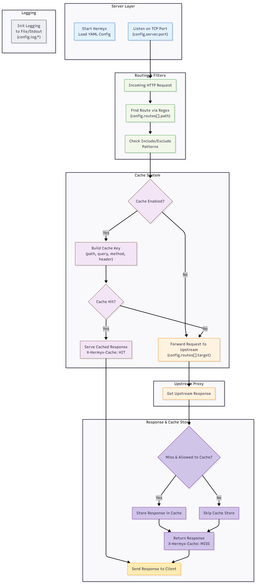

# 🌀 Hermyx

[](https://github.com/spyder01/open-project-lab)

&#x20; &#x20;

**Hermyx** is a blazing-fast, minimal reverse proxy with intelligent caching. Built on top of [`fasthttp`](https://github.com/valyala/fasthttp), it offers route-specific caching rules, graceful shutdown, flexible logging, and a clean YAML configuration — perfect for microservices, edge routing, or lightweight API gateways.

---

## 🎃 Hacktoberfest 2025

🎉 **Hermyx is participating in [Hacktoberfest 2025](https://hacktoberfest.com)!**  
We welcome contributions from developers of all experience levels.

If you're new to open source or Go, this is a great place to start.  
We have issues labeled **`good first issue`**, **`help wanted`**, and **`hacktoberfest`** to guide you.

> 💡 All merged, approved, or labeled PRs (`hacktoberfest-accepted`) count towards your Hacktoberfest contributions!

### 🧩 How to Participate

1. **Star** the repo to show support 🌟  
2. **Fork** this repository  
3. **Pick an issue** labeled:
   - `good first issue` → beginner-friendly
   - `help wanted` → needs extra attention
   - `enhancement` → new features
4. **Create a branch** for your changes  
5. **Submit a Pull Request** with a clear description  
6. Once merged, your contribution will count toward Hacktoberfest!

### 🪄 Example Ideas for Contributions

- Add tests for cache, proxy, or logging components  
- Improve error handling or config validation  
- Fix documentation typos or improve examples  
- Add small CLI enhancements (`--version`, better help text)  
- Contribute disk/Redis cache optimizations  

---

## 🚀 Features

* ⚡ **High Performance**: Powered by `fasthttp`, optimized for low-latency proxying.
* 🎯 **Per-Route Caching & Proxying**: Control cache behavior and target routing at the route level.
* 🧠 **Pluggable Caching Backends**: Choose between in-memory, disk-based, or Redis caching.
* ⏱ **TTL & Capacity Management**: Fine-grained control over cache expiry and size limits.
* 😑 **Custom Cache Keys**: Use `path`, `method`, `query`, and request `headers` to build smart cache keys.
* 🩵 **Flexible Logging**: Log to file and/or stdout with custom formats and prefixes.
* ✨ **Zero-Hassle YAML Config**: Simple, clean, and declarative.
* 🧹 **Graceful Shutdown**: Includes PID file management and safe cleanup.
* 🛠️ **Built-In Init Command**: Quickly scaffold a default config with `hermyx init`.

---

## ⚙️ Installation

> Coming soon as a prebuilt binary and via `go install`.

For now:

```bash
git clone https://github.com/your-username/hermyx.git
cd hermyx
go build -o hermyx ./cmd/go
```

---

## 📦 Usage

```bash
hermyx up --config ./configs/prod.yaml
hermyx down
hermyx init
```

---

## ⚖️ CLI Help

```bash
hermyx - blazing fast reverse proxy with smart caching

Usage:
  hermyx <command> [options]

Available Commands:
  up        Start the Hermyx reverse proxy
  down      Close the Hermyx reverse proxy
  init      Scaffold hermyx config yaml.
  help      Show help for a command

Run 'hermyx help <command>' for details on a specific command.
```

### `hermyx up`

```bash
Usage:
  hermyx up [--config <path>]

Options:
  --config   Path to Hermyx config YAML file (default: ./hermyx.config.yaml)
```

### `hermyx down`

```bash
Usage:
  hermyx down [--config <path>]

Options:
  --config   Path to Hermyx config YAML file (default: ./hermyx.config.yaml)
```

### `hermyx init`

```bash
Usage:
  hermyx init [--config <path>]

Options:
  --config   Path to Hermyx config YAML file (default: ./hermyx.config.yaml)
```

---

## 📄 Configuration Overview

Hermyx is entirely configured via a single YAML file.

### Example

```yaml
log:
  toFile: true
  filePath: "./hermyx.log"
  toStdout: true
  prefix: "[Hermyx]"
  flags: 0
  debugEnabled: true

server:
  port: 8080

storage:
  path: "./.hermyx"

cache:
  enabled: true
  type: "redis"
  ttl: 5m
  capacity: 1000
  maxContentSize: 1048576
  redis:
    address: "redis:6379"
    password: ""
    db: 0
    defaultTtl: 10s
    namespace: "hermyx:"
  keyConfig:
    type: ["path", "method", "query", "header"]
    headers:
      - key: "X-Request-User"
      - key: "X-Device-ID"
    excludeMethods: ["post", "put"]

routes:
  - name: "user-api"
    path: "^/api/users"
    target: "localhost:3000"
    include: [".*"]
    exclude: ["^/api/users/private"]
    cache:
      enabled: true
      ttl: 2m
      keyConfig:
        type: ["path", "query", "header"]
        headers:
          - key: "Authorization"
        excludeMethods: ["post"]
```

---

## 🔧 Logging Configuration Example

Hermyx supports flexible logging via the `log` section in the YAML config file. Below is an example of configuration and explanation of each field:

```yaml
log:
  toFile: true                 # write logs to a file when true
  filePath: "./hermyx.log"     # path to log file
  toStdout: true                # whether to also write logs to stdout
  prefix: "[Hermyx] "          # prefix included at start of each log line
  flags: 0                      # Go log flags: combination of log.Ldate, log.Ltime, log.Lshortfile, etc.
  debugEnabled: true           # when true, extra debug logs will be emitted


## 💡 Cache Types

Hermyx supports multiple caching backends. Choose one depending on your use case:

| Type     | Description                                        |
| -------- | -------------------------------------------------- |
| `memory` | In-memory LRU cache (fastest, non-persistent)      |
| `disk`   | Persistent file-based cache stored on disk         |
| `redis`  | Centralized cache with TTL support and namespacing |

---

## 📜 Configuration Reference

### 🔹 `log`

| Field          | Type   | Description            |
| -------------- | ------ | ---------------------- |
| `toFile`       | bool   | Write logs to a file   |
| `filePath`     | string | Path to log file       |
| `toStdout`     | bool   | Write logs to stdout   |
| `prefix`       | string | Log line prefix        |
| `flags`        | int    | Go-style log flags     |
| `debugEnabled` | bool   | Print extra debug logs |

### 🔹 `server`

| Field  | Type | Description       |
| ------ | ---- | ----------------- |
| `port` | int  | Port to listen on |

### 🔹 `storage`

| Field  | Type   | Description                |
| ------ | ------ | -------------------------- |
| `path` | string | Path for storing PID, etc. |

### 🔹 `cache`

| Field            | Type        | Description                             |
| ---------------- | ----------- | --------------------------------------- |
| `enabled`        | bool        | Enable/disable global caching           |
| `type`           | string      | One of `memory`, `disk`, or `redis`     |
| `ttl`            | duration    | Global default TTL for cache entries    |
| `capacity`       | int         | Max cache entries (in memory/disk)      |
| `maxContentSize` | int         | Max body size (bytes) to store in cache |
| `keyConfig`      | KeyConfig   | Rules for generating cache keys         |
| `redis`          | RedisConfig | Redis-specific configuration            |

### 🔹 `routes`

| Field     | Type             | Description                              |
| --------- | ---------------- | ---------------------------------------- |
| `name`    | string           | Route identifier                         |
| `path`    | string           | Regex pattern for matching request paths |
| `target`  | string           | Upstream target address                  |
| `include` | \[]string        | List of sub-paths to include             |
| `exclude` | \[]string        | List of sub-paths to exclude             |
| `cache`   | CacheRouteConfig | Route-specific cache settings            |

### 🔹 `KeyConfig`

| Field            | Type            | Description                                                        |
| ---------------- | --------------- | ------------------------------------------------------------------ |
| `type`           | \[]string       | Which parts to include in key: `path`, `method`, `query`, `header` |
| `excludeMethods` | \[]string       | HTTP methods to ignore for caching (e.g. `POST`)                   |
| `headers`        | \[]HeaderConfig | Specific headers to include in the cache key                       |

### 🔹 `HeaderConfig`

| Field | Type   | Description            |
| ----- | ------ | ---------------------- |
| `key` | string | Header name to include |

---

## 🔀 How It Works

1. **Route Match**: Request is matched to a route using regex.
2. **Filter**: Include/exclude patterns are evaluated.
3. **Caching**:

   * Method or config can skip caching.
   * Cache key is built using selected components.
   * Cache is checked (in-memory, disk, or Redis).
4. **Proxy**:

   * If cache hit, serve response.
   * If miss, proxy request and cache result if allowed.
5. **Response**:

   * Adds `X-Hermyx-Cache: HIT` or `MISS` header.

---

## 📈 Hermyx Flow Diagram



---

## 🧾 Debugging Tips

* Enable `log.toStdout: true` and set `flags: 0` for clear log output.
* Inspect cache behavior using the `X-Hermyx-Cache` response header.
* For Redis, observe key TTL using:

```bash
redis-cli --ttl hermyx:<cache-key>
```

* Use meaningful request headers (like `X-User-ID` or `Authorization`) to build user-specific cache keys.

---

## 📌 Roadmap

* [ ] Add CLI auto-update
* [ ] Hot config reloading
* [ ] Built-in metrics via Prometheus
* [ ] Plugin system for auth/middleware

---

## 🧑‍💻 Contributing

PRs, bug reports, and ideas are welcome! Just fork and open a PR.

---

## 📄 License

This project is licensed under the [MIT License](./LICENSE).


